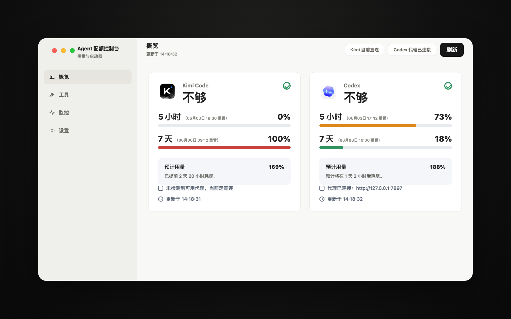

# Agent Quota Control

Agent Quota Control is a macOS menu bar app for people who use Kimi Code and
Codex heavily and want one quiet place to watch quota pressure, proxy state, and
launcher shortcuts.

It keeps the menu bar compact, then moves the detailed controls into a Tauri
dashboard: quota cards, reset times, projected weekly usage, selected tools,
service monitoring, credentials, and per-service proxy settings.



## Features

- Monitor Kimi Code and Codex 5-hour and 7-day quota windows.
- Show reset timestamps next to each quota tier.
- Estimate whether the current weekly usage pace is enough, tight, or likely to
  run out.
- Freeze weekly projections after a quota first reaches 100%, so the estimate
  does not become misleading as reset time approaches.
- Display separate Kimi and Codex menu bar items with service icons and compact
  usage summaries.
- Manage detected IDE, app, and CLI launchers from the dashboard.
- Launch CLI tools from a chosen project folder through Ghostty, with Terminal
  fallback.
- Store Kimi API keys in macOS Keychain or an encrypted vault.
- Read Codex auth from the local Codex CLI login state.
- Configure Kimi and Codex proxies independently with Auto, On, and Off modes.

## Status

This project is macOS-first and currently optimized for local use. It is useful
today, but still early: UI polish, packaging, and provider edge cases are being
actively improved.

## Install From Source

Requirements:

- macOS 13 or newer
- Rust 1.85 or newer
- Node.js 22 or newer
- pnpm 10 or newer

Install dependencies:

```bash
pnpm install
```

Run in development:

```bash
pnpm dev
```

Build a release app:

```bash
pnpm tauri build
```

The built app is written to:

```text
src-tauri/target/release/bundle/macos/Agent Quota Control.app
```

## Usage

Open the app and use the menu bar icons to access the dashboard. Closing the
dashboard hides the window and removes the Dock icon while keeping the Kimi and
Codex menu bar items running. Click a menu bar item to show the dashboard again.

The dashboard has four sections:

- Overview: Kimi Code and Codex quota cards.
- Tools: selected launchers and available detected tools.
- Monitoring: service toggles, Kimi API key storage, and Codex auth status.
- Settings: proxy settings and config directory access.

## Proxy Settings

Kimi and Codex each have independent proxy settings:

- Auto: try a custom proxy URL first, then `127.0.0.1:7897`, then
  `127.0.0.1:7890`; if none are reachable, use direct connection.
- On: force the configured proxy URL.
- Off: connect directly.

The UI explains proxy state in Chinese so users can distinguish direct
connection, connected proxy, and proxy configuration problems.

## Credentials

Kimi API keys can be saved from the dashboard. Two storage backends are
supported:

- Keychain: stores the API key directly in macOS Keychain.
- Encrypted Vault: stores ciphertext in the app config directory and stores the
  vault master key in macOS Keychain.

Codex credentials are read from Codex CLI Keychain entries or
`~/.codex/auth.json`. Run `codex login` if Codex usage cannot be fetched.

## CLI Launching

CLI tools require a real executable path. Config directories such as `~/.codex`
or `~/.claude` are never treated as executable commands.

When launching a CLI tool, the dashboard asks for a project folder. The app then
opens Ghostty when available, or Terminal as a fallback, and runs the selected
binary from that folder.

## Development Checks

```bash
pnpm typecheck
pnpm test:frontend
cargo check --manifest-path src-tauri/Cargo.toml
cargo test --manifest-path src-tauri/Cargo.toml
cargo clippy --manifest-path src-tauri/Cargo.toml -- -D warnings
pnpm tauri build
```

## Repository Layout

```text
frontend/       React, Vite, TypeScript dashboard
src-tauri/      Tauri v2 shell, tray, providers, config, credentials
docs/           README screenshots and project documentation assets
.github/        CI workflow
```

The app config directory remains `kimi-code-status` for compatibility with
earlier local installs.

## License

MIT
