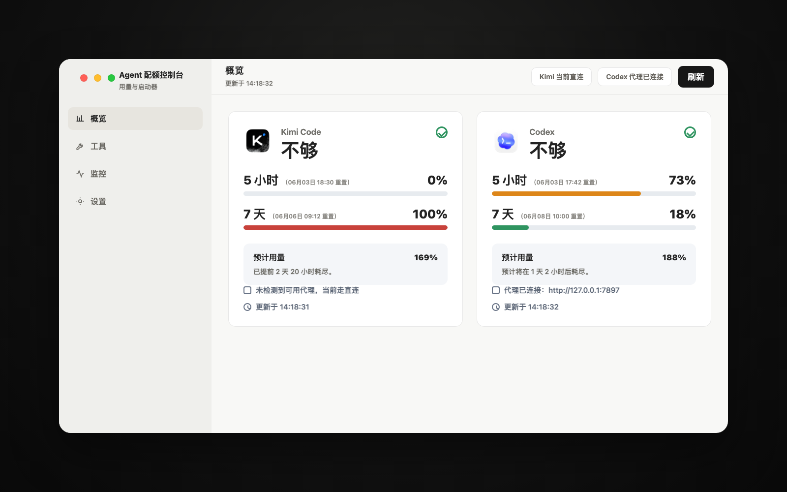

# Agent Quota Control

Agent Quota Control is a macOS menu bar app for people who use Kimi Code and
Codex heavily and want one quiet place to watch quota pressure, proxy state, and
menu-bar state.

It keeps the menu bar compact, then moves the detailed controls into a Tauri
dashboard: quota cards, reset times, projected weekly usage, service monitoring,
credentials, and per-service proxy settings.



## Features

- Monitor one or more Kimi Code and Codex accounts and their available quota
  windows.
- Show reset timestamps next to each quota tier.
- Plot observed weekly utilization against time and project it from a
  recent-weighted consumption trend.
- Estimate whether the recent weekly usage pace is enough, tight, or likely to
  run out, including the expected exhaustion time when applicable.
- Freeze weekly projections after a quota first reaches 100%, so the estimate
  does not become misleading as reset time approaches.
- Display separate Kimi and Codex menu bar items with independently selectable
  service icons, usage percentages, and sufficiency text.
- Open ChatGPT from the menu bar with a dedicated fixed 7897 proxy launch mode.
- Add configurable native macOS widgets that select a monitored account and
  share the dashboard's redacted quota snapshot.
- Store Kimi API keys in macOS Keychain or an encrypted vault.
- Read Codex auth from the local Codex CLI login state.
- Configure Kimi and Codex proxies independently with Auto, On, and Off modes.

## Status

This project is macOS-first and currently optimized for local use. It is useful
today, but still early: UI polish, packaging, and provider edge cases are being
actively improved.

## Install From Source

Requirements:

- macOS 13 or newer
- macOS 14 or newer for the WidgetKit extension
- Rust 1.85 or newer
- Node.js 22 or newer
- pnpm 10 or newer
- Xcode and an Apple Development signing identity for a widget-enabled bundle

Install dependencies:

```bash
pnpm install
```

Run in development:

```bash
pnpm dev
```

Build and sign a release app with the WidgetKit extension:

```bash
pnpm build:macos-app
```

The built app is written to:

```text
src-tauri/target/release/bundle/macos/Agent Quota Control.app
```

## Usage

Open the app and use the menu bar icons to access the dashboard. Closing the
dashboard hides the window and removes the Dock icon while keeping the Kimi and
Codex menu bar items running. Click a menu bar item to show the dashboard again.

Weekly forecasts use successful observations from the most recent 24 hours,
weighted toward newer activity. A stable short-window path can respond after at
least five observations cover 20 minutes, but only when the newest sample is
fresh, adjacent samples are no more than 10 minutes apart, utilization rises by
at least two percentage points, and the weighted linear fit is sufficiently
stable. This prevents integer percentage steps and isolated bursts from being
extrapolated into misleading hourly rates. Otherwise, the normal path requires
at least three observations spanning 30 minutes and expands from 24 to 48 hours
when needed. If neither path qualifies, the dashboard shows the actual line and
waits for more trend data instead of falling back to a misleading full-cycle
average. Observations are stored in `usage-history.json` under the app
configuration directory and are automatically bounded and pruned.

The dashboard has three sections:

- Overview: one canonical quota card per monitored account.
- Monitoring: service selection, independent menu-bar icon/percentage/state-text
  toggles, and Kimi/Codex account management.
- Settings: proxy settings and config directory access.

Each service menu includes a dedicated `通过 7897 代理打开 ChatGPT` action.
It starts the installed ChatGPT app executable with HTTP/HTTPS proxy variables,
SOCKS proxy variables, and Chromium proxy arguments fixed to `127.0.0.1:7897`.
The action is disabled when ChatGPT is missing or already running, because an
already-running process cannot be retrofitted with a different startup proxy.

## Proxy Settings

Kimi and Codex each have independent proxy settings:

- Auto: try a custom proxy URL first, then `127.0.0.1:7897`, then
  `127.0.0.1:7890`; if none are reachable, use direct connection.
- On: force the configured proxy URL.
- Off: connect directly.

The UI explains proxy state in Chinese so users can distinguish direct
connection, connected proxy, and proxy configuration problems.

## Credentials

Kimi API keys can be saved from the dashboard. Two storage backends are
supported:

- Keychain: stores the API key directly in macOS Keychain.
- Encrypted Vault: stores ciphertext in the app config directory and stores the
  vault master key in macOS Keychain.

Additional Kimi accounts store isolated per-account credentials. Codex accounts
are imported from the current Codex CLI login into app-owned Keychain entries,
so changing the CLI login does not silently replace an existing monitored
account. Run `codex login` before importing when no valid ChatGPT login exists.

## CLI Launching

CLI tools require a real executable path. Config directories such as `~/.codex`
or `~/.claude` are never treated as executable commands.

When launching a CLI tool, the dashboard asks for a project folder. The app then
opens Ghostty when available, or Terminal as a fallback, and runs the selected
binary from that folder.

## Development Checks

```bash
pnpm typecheck
pnpm test:frontend
cargo check --manifest-path src-tauri/Cargo.toml
cargo test --manifest-path src-tauri/Cargo.toml
cargo clippy --manifest-path src-tauri/Cargo.toml -- -D warnings
swift test --package-path macos-widget
pnpm build:macos-app
```

## Repository Layout

```text
frontend/       React, Vite, TypeScript dashboard
src-tauri/      Tauri v2 shell, tray, providers, config, credentials
macos-widget/   SwiftUI, WidgetKit, App Intents, and shared snapshot decoder
scripts/        macOS widget build, signing probe, and app packaging
docs/           README screenshots and stable design documentation
.github/        CI workflow
```

The app config directory remains `kimi-code-status` for compatibility with
earlier local installs.

## License

MIT
